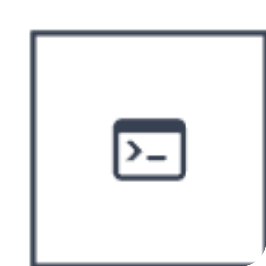
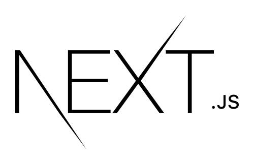
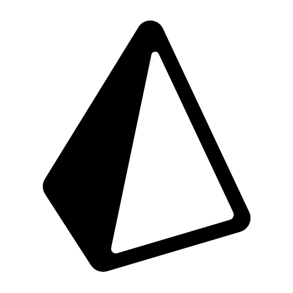
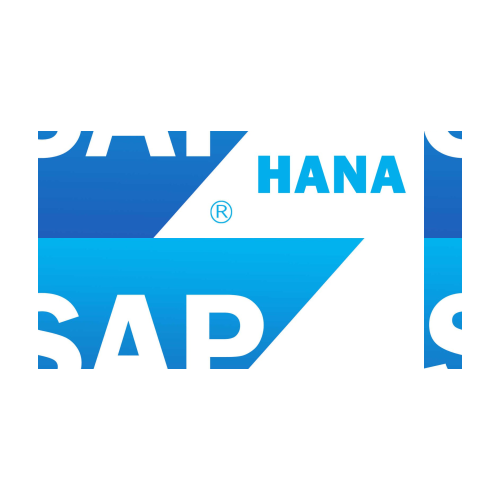

# Hello, I'm Vitor !
A technology enthusiast who loves gaming 🎮, coding 💻 and learning 📚.

 

  <a href="https://github.com/vitorvaske6">
  
  

## My Socials

 
    <a href="https://vitor-vaske.com.br/" target="_blank" style="display:flex; gap:8px; place-items:middle">
      
      Portifolio
    </a>
    <a href="https://www.linkedin.com/in/vitor-hugo-vasconcelos/" style="display:flex; gap:8px; place-items:middle">
      
      Linkedin
    </a>
    <a href="mailto:vitorvaske6@gmail.com" style="display:flex; gap:8px; place-items:middle">
      
      Gmail
    </a>
</ul>

## Experiences
### Current Job

| FullStack project. | Integrations & Automations Project. | 
|-------|--------------| 
| Deployed as [My Insights](https://www.myinsights.com.br/)  | Modified version of [Integratis](https://github.com/vitorvaske6/integratis/)  |
| <code></code>&nbsp;&nbsp;Next.js | <code></code>&nbsp;&nbsp;Node.js |
| <code></code>&nbsp;&nbsp;TypeScript | <code></code>&nbsp;&nbsp;Typescript |
| <code></code>&nbsp;&nbsp;Microsoft SQL Server | <code></code>&nbsp;&nbsp;MongoDB |
| <code></code>&nbsp;&nbsp;Prisma | <code></code>&nbsp;&nbsp;Python |
| <code></code>&nbsp;&nbsp;Tailwind | <code></code>&nbsp;&nbsp;Microsoft SQL Server |
| <code></code>&nbsp;&nbsp;Power BI | <code></code>&nbsp;&nbsp;SAP Hana |
| <code></code>&nbsp;&nbsp;Figma
|  |  |

### Previous Experiences

| Previous Job | Learned for Curiosity or University Projects | 
|---------------|----------------------------------------------|
| Those languages and tools were used mostly because of [Alfresco](https://www.alfresco.com/) open source development. | Languanges and tools that I learned for curiosity or university projects. | 
| <code></code> &nbsp;&nbsp;JavaScript | <code></code>&nbsp;&nbsp;Figma.
| <code></code> &nbsp;&nbsp;Apache Maven | <code></code>&nbsp;&nbsp;JavaScript
| <code></code> &nbsp;&nbsp;Apache Tomcat | <code></code>&nbsp;&nbsp;Node.js
| <code></code> &nbsp;&nbsp;Freenarker | <code></code>&nbsp;&nbsp;HTML
| <code></code> &nbsp;&nbsp;Docker | <code></code> &nbsp;&nbsp;CSS
| <code></code> &nbsp;&nbsp;Java | |

